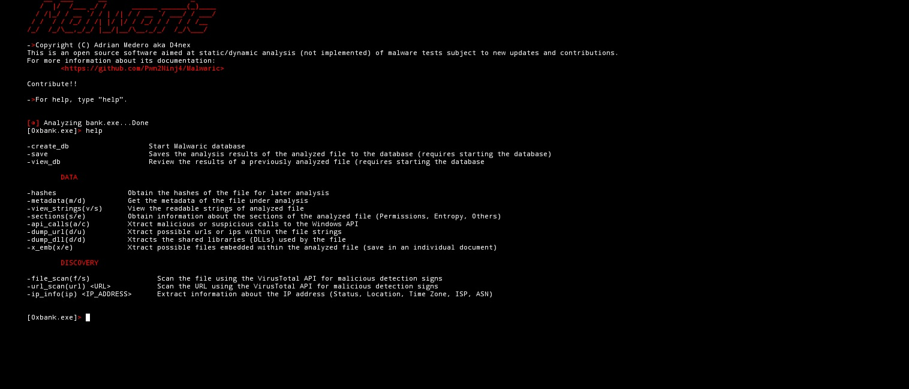

<h2 align="center">Malwaric</h2>
<p align="center">
    This is an open source software oriented at malware examples static/dynamic analysis (not implemented).
</p>

# Installation
```console
kali@d4nex~$ git clone https://github.com/Pwn2Ninj4/Malwaric/
kali@d4nex~$ cd Malwaric
kali@d4nex~$ pip3 install -r requirements.txt
kali@d4nex~$ python3 malwaric.py -f <malware_example.exe> -i
```
## Config your VT API token
```console
kali@d4nex~$ nano config.py
# config.py
VERSION = '0.5'
# API TOKEN VIRUS TOTAL
API_TOKEN = "" #Replace with your Api token


FILE_PATH = "Malwaric/malwaric.py"
```



# Utilities

## Malwaric Hashes

***MalwaricHashes*** is a class to analyze the hashes of a binary 
### Hashes:
- `MD5`
- `SHA1`
- `SHA256`

## MalwaricData

***MalwaricData*** is a class to extract data about the analyzed binary (Metadata, Sections, Urls and embedded files, among other things)

- Method `METADATA`: Extract binary's metadata.
  
- Method `STRINGS`: Extra the strings from the binary with a length of 10 or more.
  
- Method `SECTIONS`: List the sections of a binary and its characteristics(Perms, Addresses, Entropy, etc).
  
- Method `API_CALLS`: Shows malicious Windows API calls made by the binary.

- Method `DUMP_URL`: Extract possible urls or IP addresses within the binary strings.

- Method `DUMP_IMPORT`: Shows the DLLs used by the binary.

- Method `EXTRACT_EMB`: Extract possible files embedded within the binary.

## MalwaricDiscovery

***MalwaricDiscovery*** is a class for analyzing files and hosts using the Virus Total API and discovery.
            
- Method `VTSCAN_FILE`: Scans the file using the VT API to detect possible signatures similar to other malware within the binary.

- Method `VTSCAN_URL`: Scan a url using the VT api to detect possible malware within the urls.
        
- Method `IP_INFO`: Extract geolocation data from an IP address.

## Analysis Database(Interactive mode example)

```bash
[◑] Analyzing bank.exe...Done
[0xbank.exe]> create_db
[◑] Creating database...Done

[0xbank.exe]> save
        >Add a status: malicious
        >Add the engines that detected "malicious": 4
        >Add a note: This is a malware sample
[◑] Saving analysis in the database...Done

[0xbank.exe]> view_db
[◑] Loading Database...Done
(1, 'bank.exe', '9d963de4eb78abfd6fbc384e974099a0', '2024-12-15 12:52:12', 'malicious', 4, 'This is a malware sample')

[0xbank.exe]>
```
# Notes

- This software is a personal project, so it is still under development, this version tries to give a view of what the software is oriented to.
- This software is subject to contributions.
- This version only supports Portable Executable(PE) files
